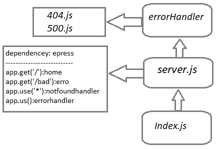

# server-deployment-practice

## Deployment Test
Author: Anwar Abbass
[tests report](https://github.com/AnwarAbbass/server-deployment-practice/runs/2641942990?check_suite_focus=true)
[heroku](https://anwarabbass-server-deploy-dev.herokuapp.com/)
## Setup
`.env` requirements
`dotenv`  requirements
`express`  requirements
`jest`  requirements
`supertest`  requirements
PORT - Port Number

## Running the app
npm start
- Endpoint: / 
Returns Object

{
  'welcome to server.js'
}

- Endpoint: /bad
Returns Object

{
  'something error'
}


## Tests
Unit Tests: npm run test

------------------------------------------|---------|----------|---------|---------|-------------------
File                                      | % Stmts | % Branch | % Funcs | % Lines | Uncovered Line #s
------------------------------------------|---------|----------|---------|---------|-------------------
All files                                 |   88.24 |      100 |   66.67 |    87.5 |
 server-deployment-practice               |   84.62 |      100 |      50 |   83.33 |
  server.js                               |   84.62 |      100 |      50 |   83.33 | 19-20
 server-deployment-practice/errorHandlers |     100 |      100 |     100 |     100 |
  404.js                                  |     100 |      100 |     100 |     100 |
  500.js                                  |     100 |      100 |     100 |     100 |

***********

Test Suites: 1 passed, 1 total
Tests:       3 passed, 3 total
Snapshots:   0 total
Time:        41.955 s

Lint Tests: npm run dev
```
[nodemon] starting `node index.js`
listen on port 3000
```

UML


